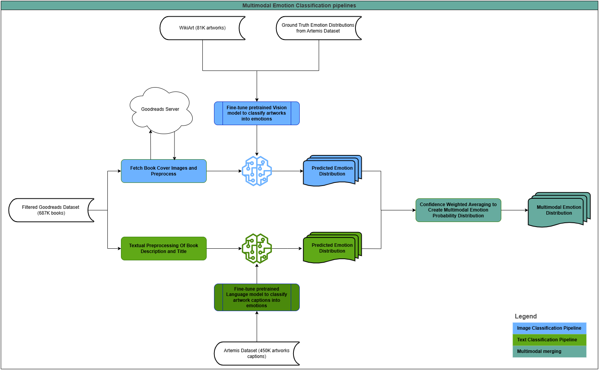

# MSc Data Science Thesis: Emotion-Based Book Recommendations

This repository contains the code for a Master's thesis on emotion-based book recommendation systems using multimodal deep learning approaches. The project compares vision-based models (ResNet, EmotionCLIP) and text-based models (LSTM, BERT) for emotion classification of books using cover images and descriptions.

### System Architecture

The project implements a multimodal emotion classification pipeline that processes both visual and textual features:



### Web Application Workflow

The trained model and book data is integrated into a web application for book recommendations:

It is hosted locally right now and can be accessed here: https://major-thankfully-molly.ngrok-free.app/

Available untill 25-07-2025.

**[Website Documentation](website/README.md)**

## Required Datasets

### Download Instructions

Due to size constraints, datasets must be downloaded separately:

#### 1. ArtEmis Dataset
Download the ArtEmis data from: https://github.com/Vision-CAIR/artemis-v2/tree/master
Extract to: data/artemis/

Clone the ArtEmis code from: https://github.com/optas/artemis

This is necessary for creating the ArtEmis-V2 dataset and following the same preprocessing steps as done in their paper.

#### 2. Goodreads Dataset
Download from: https://cseweb.ucsd.edu/~jmcauley/datasets/goodreads.html
Only goodreads_books.json.gz is required but I downloaded the reviews data aswell
Extract to: data/goodreads/


#### 3. WikiArt Images
Download WikiArt dataset from: https://drive.google.com/file/d/1vTChp3nU5GQeLkPwotrybpUGUXj12BTK/view
Extract to: data/wikiart_extracted/

This is quite large and requires around 25GB of storage

#### 4. Model checkpoints
All model checkpoints are available here: https://amsuni-my.sharepoint.com/:f:/g/personal/friso_harlaar_student_uva_nl/EjVbk_qfewtKmy36xUV8nYwBE2v8wt7qn4o49MmHp0wxwQ?e=fgPXfF 

Or can be retrained from the training scripts in the artemis_scripts folder. 

EmotionCLIP code can be found here: https://huggingface.co/jiangchengchengNLP/EmotionCLIP-V2

### Expected Data Structure
```
artemis_scripts/
├── models/
│   ├── emotionclip_latest.pt
│   ├── resnet.pt
│   ├── bert_based/
│   │   └── best_model/
│   │       └── [model files...]
│   └── lstm_based/
│       └── best_model_lstm.pt
├── preprocessed_data/
│   ├── artemis_gt_references_grouped.pkl
│   ├── artemis_preprocessed.csv
│   ├── config.json.txt
│   ├── vocabulary.pkl
│   └── data/
│       └── [preprocessed data files from running artemis preprocessing script + Glove vocabulary]
data/
├── artemis/
├── goodreads/
│   └── goodreads_books/
│       └── goodreads_books.json.gz
└── wikiart_extracted/
    ├── Abstract_Expressionism/
    ├── Action_painting/
    └── [other art movements]/
```

## Setup Instructions

### 1. Environment Setup
Create virtualenvironment or conda environment

# Install dependencies
pip install -r requirements.txt

## Workflow Steps

### Step 1: Data Preprocessing

#### ArtEmis Preprocessing
```bash
# Run preprocessing notebook
jupyter notebook artemis_preprocessing.ipynb
```
- Loads ArtEmis emotion annotations
- Processes WikiArt images
- Creates train/validation/test splits
- Generates ground truth emotion distributions

#### Goodreads Preprocessing/EDA
```bash
# Run exploratory analysis
jupyter notebook "Exploratory Data Analysis.ipynb"
```
- Analyzes Goodreads dataset structure
- Filters English books with descriptions and covers
- Creates preprocessed book dataset

### Step 2: Model Training

#### ResNet Training -> definitely need GPU for this
```bash
# Train ResNet on ArtEmis
jupyter notebook image_to_emotion_classifier.ipynb
```
- Fine-tunes ResNet on emotion classification
- Uses WikiArt images with ArtEmis emotion labels
- Saves best model checkpoint

#### BERT Training -> need GPU for this
```bash
python utterance_to_emotion_with_transformer_my_try.py
```
- Fine-tunes BERT on emotion classification
- Uses ArtEmis utterances with emotion labels
- Saves model to `predictions/bert_based/best_model/`

#### EmotionCLIP Fine-tuning (Not working)
```bash
# Experimental fine-tuning approach
jupyter notebook artemis_emotionclip_finetune_attempt.ipynb
```

### Step 3: Model Application

#### Apply ResNet to Goodreads
```bash
jupyter notebook goodreads_apply_resnet.ipynb
```
- Processes book cover images
- Generates emotion predictions for all books
- Supports checkpoint/resume functionality
- Outputs: `goodreads_emotion_results/`

#### Apply BERT to Goodreads
```bash
jupyter notebook goodreads_apply_bert.ipynb
```
- Processes book descriptions
- Generates emotion predictions for all books
- Supports checkpoint/resume functionality
- Outputs: `goodreads_bert_emotion_results/`

### Step 4: Model Evaluation

#### Generate Test Predictions
Ensure you have test predictions in CSV format:
```
classification_results/
    test_results/
    ├── artemis_resnet_test_predictions.csv
    ├── artemis_emotionclip_test_predictions.csv
    ├── artemis_lstm_test_predictions.csv
    └── artemis_bert_test_predictions.csv
```

#### Run Evaluation On Test data
```bash
jupyter notebook evaluate_all_models.ipynb
```

### Step 5: Survey Analysis

#### Statistical Analysis
```bash
survey_analysis/statistical_tests_survey.ipynb
```
- Analyzes user study results
- Performs repeated measures ANOVA and t-tests
- Conducts power analysis
- Compares model recommendations


